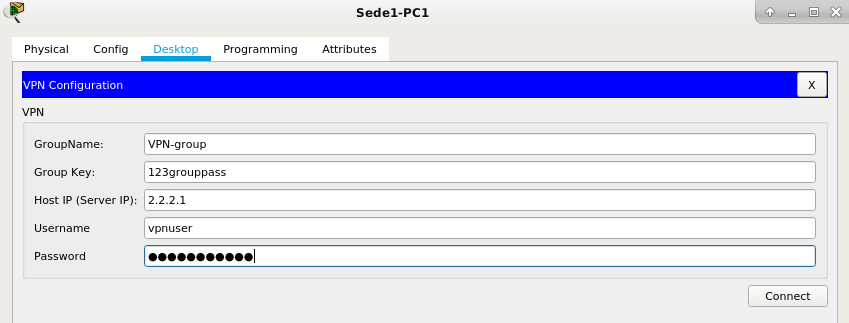

# VPN client-to-gateway

Mentre in una VPN site-to-site sono i router di confine (detti peer o VPN gateway) a negoziare e ad instaurare il tunnel, in una VPN client-to-gateway gli attori coinvolti sono un router e un client.

La suite di tecnologie interessate (protocolli, algoritmi crittografici, funzioni di hash) è pressoché la stessa di una VPN site-to-site. Per una rassegna più esaustiva, si rimanda quindi all'altra trattazione.

## Cisco IOS

Di seguito sono elencati i comandi necessari alla configurazione della VPN: rispetto alla topologia impiegata nell'esercitazione, debbono essere eseguiti sul router R2.

Attiviamo la modalità di configurazione:

```cisco
R2>enable
R2#configure terminal
Enter configuration commands, one per line.  End with CNTL/Z.
R2(config)#
```

L'autenticazione dei client avverrà utilizzando le credenziali memorizzate all'interno del database locale:

```cisco
aaa new-model
aaa authentication login VPN-user local
aaa authorization network VPN-group local

username vpnuser secret 123userpass
```

Analogamente alla configurazione di una VPN site-to-site, anche una VPN client-to-gateway basa la procedura di negoziazione del tunnel sul protocollo IKE, non ché su algoritmi crittografici e funzioni crittografiche di hash.

I seguenti parametri caratterizzano la negoziazione della ISAKMP Security Association (fase 1):

```cisco
crypto isakmp policy 10
encryption aes
hash sha
group 2
authentication pre-share
lifetime 3600
exit
```

Un client non è conoscenza delle specifiche di configurazione di networking che dovrà assumere. Queste sono definite sul router, il quale si occuperà di inviarle al client.

Innanzi tutto, procediamo alla configurazione di un pool di indirizzi IP (si noti che il pool è un sotto insieme della *slash 24* in uso nella LAN):

```cisco
ip local pool VPN-pool 192.168.1.100 192.168.1.110
```

Una **IKE policy group** (nel nostro caso denominata VPN-group) contiene le specifiche che verranno attribuite ai client; queste sono protette da una chiave di accesso che è necessario conoscere:

```cisco
crypto isakmp client configuration group VPN-group
key 123grouppass
pool VPN-pool
exit
```

Le seguenti specifiche sono necessarie per la negoziazione della IPSec Security Association (fase 2). 

Curiosità: reverse-route si riferisce a **reverse route injection (RRI)**, una funzionalità capace di attribuire automaticamente al client remoto regole di routing statiche, affinché sia possibile raggiungere la rete privata di destinazione.

**crypto dynamic-map** invece, offre la possibilità di condurre a compimento la procedura di negoziazione, sebbene alcune informazioni del client remoto non siano conosciute a priori (ad esempio il suo indirizzo iP sorgente).

```cisco
crypto ipsec transform-set VPN-set esp-aes esp-sha-hmac 
crypto dynamic-map VPN-dynamic-map 10
set transform-set VPN-set
reverse-route
exit
```

Infine, procediamo alla definizione di una mappa crittografica denominata VPN-static-map. Una mappa crittografica (crypto map) è un'entità di configurazione che assolve a vari compiti, tra cui:

1. selezionare i flussi di dati che richiedono un'elaborazione di sicurezza;
2. definire la politica di sicurezza per questi flussi (mediante l'associazione con il dynamic map denominato VPN-dynamic-map, precedentemente definito);
3. stabilire le specifiche di autenticazione e autorizzazione richieste al client (rispettivamente: VPN-user e VPN-group).

```cisco
crypto map VPN-static-map client configuration address respond
crypto map VPN-static-map client authentication list VPN-user
crypto map VPN-static-map isakmp authorization list VPN-group
crypto map VPN-static-map 10 ipsec-isakmp dynamic VPN-dynamic-map
```

Infine, è necessario applicare il crypto map all'interfaccia outside del router.

```bash
interface Serial0/1/0
crypto map VPN-static-map 
```

A questo punto è possibile procedere alla configurazione del client e alla connessione con il gateway VPN.

